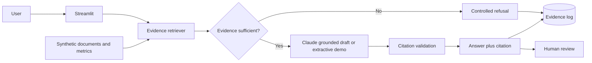

# ESG Reporting AI Assistant

> A public, auditable prototype that answers ESG reporting questions from synthetic evidence, cites its sources, refuses unsupported requests and logs every interaction for review.

**Status:** Public MVP · synthetic data only · not production-grade · human review mandatory

## Business problem

ESG and sustainability-reporting teams work across policies, PAI statements, metric files and disclosure drafts. Manual extraction is slow, inconsistent and difficult to evidence. In a regulated process, a plausible answer is not enough: the reviewer must know which source supported it, what the system retrieved and why the system answered or refused.

This prototype demonstrates the control layer first. It is designed for ESG reporting, governance, risk, audit and data teams that need AI-assisted drafting without surrendering source traceability or human accountability.

## Live control behaviour

- Retrieves evidence from a small synthetic ESG document library.
- Preserves source, section or CSV-row metadata for citation.
- Refuses to answer when the retrieval score is below a configurable threshold.
- Sends only retrieved evidence to Claude when an API key is configured.
- Rejects a model response that contains no supplied citation.
- Logs the question, evidence, score, model, status, answer and review flag in SQLite.
- Runs in safe extractive demo mode when no Anthropic API key is present.

## Architecture



The first public increment uses transparent TF-IDF retrieval. The planned next increment replaces it with embeddings and a vector database while preserving the same evidence contract, refusal rule and audit log.

## Controls and audit design

| Risk | Control in the prototype |
|---|---|
| Hallucinated or unsupported answer | Minimum evidence threshold; no evidence means no answer |
| Untraceable claim | Exact source citation attached to retrieved chunks and required in the answer |
| Model ignores citation instructions | Post-generation citation validator triggers a controlled refusal |
| Automation replaces accountable judgement | Every result is labelled as a draft requiring human review |
| Interaction cannot be reconstructed | SQLite log records question, evidence, score, model, answer, status and timestamp |
| Confidential information reaches GitHub | Synthetic data only; secrets and local databases are ignored |

See [`docs/control_mapping.md`](docs/control_mapping.md) for the detailed mapping.

## Repository structure

```text
esg-reporting-ai-assistant/
├── app.py
├── README.md
├── requirements.txt
├── .env.example
├── .gitignore
├── src/
│   ├── assistant.py
│   ├── audit.py
│   ├── documents.py
│   └── retrieval.py
├── sql/
│   └── evidence_log.sql
├── data/
│   ├── esg_metrics.csv
│   └── documents/
│       ├── synthetic_fund_sustainability_policy.md
│       └── synthetic_pai_statement.md
└── docs/
    ├── architecture.md
    └── control_mapping.md
```

## Run locally

### 1. Create and activate the virtual environment

From PowerShell, inside the repository folder:

```powershell
python -m venv .venv
.\.venv\Scripts\Activate.ps1
```

### 2. Install the dependencies

```powershell
python -m pip install --upgrade pip
pip install -r requirements.txt
```

### 3. Optional: connect the Claude API

The app works without an API key in extractive demo mode. To enable grounded Claude drafting:

```powershell
Copy-Item .env.example .env
notepad .env
```

Insert the key in `.env`. Never commit `.env`.

### 4. Start the application

```powershell
streamlit run app.py
```

Open the local address shown in PowerShell, normally `http://localhost:8501`.

## Suggested test questions

1. `What was the fund's financed-emissions intensity in 2025?`
2. `What engagement escalation is required after two unsuccessful cycles?`
3. `Which principal adverse impact indicator exceeded its threshold?`
4. `What was the fund's water consumption in 2025?` — this should demonstrate insufficient evidence rather than invention.

## Deploy on Streamlit Community Cloud

1. Push this repository to GitHub as `esg-reporting-ai-assistant`.
2. Sign in to Streamlit Community Cloud with GitHub.
3. Create a new app and select this repository, branch `main`, file `app.py`.
4. In **Advanced settings → Secrets**, optionally add:

```toml
ANTHROPIC_API_KEY = "your-key"
ANTHROPIC_MODEL = "claude-sonnet-5"
```

5. Deploy and add the resulting public URL to this README and the GitHub repository description.

Do not commit `.streamlit/secrets.toml`; deployed secrets belong in Community Cloud settings.

## Limitations

- This is a portfolio prototype, not a production reporting system.
- The evidence library is small and entirely synthetic.
- Retrieval is lexical TF-IDF rather than embedding-based semantic retrieval.
- Citation validation confirms that a supplied citation appears; it does not yet verify every individual claim.
- SQLite storage on Community Cloud is demonstrative and may reset when the app restarts.
- There is no authentication, role-based access, document approval or durable workflow state.
- No output is legal, regulatory, investment or assurance advice.

## Roadmap

- [ ] Add embeddings and a vector store.
- [ ] Add PDF ingestion with page-level citations.
- [ ] Build a labelled retrieval and faithfulness evaluation set.
- [ ] Add PostgreSQL-backed durable evidence logging.
- [ ] Add reviewer approve/reject workflow and role separation.
- [ ] Add mock SAP ESG data ingestion through an OData-style endpoint.
- [ ] Record a 60–90 second demonstration GIF.

## Data and confidentiality disclaimer

All documents, entities, figures and metrics in this repository are fictional and were created solely for demonstration. No real client, employer, fund, investor or regulated production data is included.

## Author

**Ernesto Wendling** — regulated finance, ESG governance and auditable AI automation.
