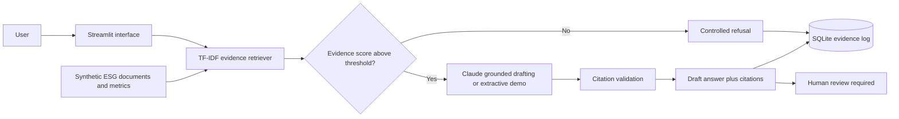

# Architecture

## Production evolution

1. Replace TF-IDF with embeddings and a managed vector store.
2. Parse controlled source PDFs with page-level metadata.
3. Persist the evidence log in PostgreSQL with authenticated users.
4. Add evaluation datasets for retrieval quality, faithfulness and refusal behaviour.
5. Integrate governed ESG metrics from source systems, including an SAP-oriented interface layer.
